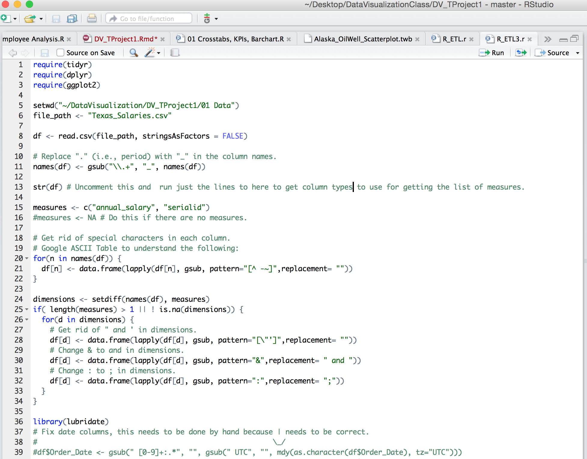
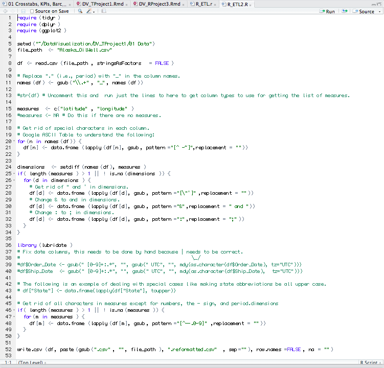

This is an R Markdown document. Markdown is a simple formatting syntax for authoring HTML, PDF, and MS Word documents. For more details on using R Markdown see <http://rmarkdown.rstudio.com>.

When you click the **Knit** button a document will be generated that includes both content as well as the output of any embedded R code chunks within the document. You can embed an R code chunk like this:

#For this project, we are going to use the Baltimore Salaries and Texas Salaries datasets to produce the scatter plot, crosstab with KPI and parameters, and also a bar chart with reference lines on a Shiny Application
  
#First, we need to source the following packages
```{r}
require("ggplot2")
require("ggtheme")
require("gplots")
require("grid")
require("RCurl")
require("reshape2")
require("tableplot")
require("tidyr")
require("dplyr")
require("jsonlite")
require("extrafont")
require("lubridate")
```
  
#Next, we need to run the Texas Salaries R_ETL.R and Baltimore Salaries R_ETL.R to create the 2 tables on SQL server.  
##First Table is about Texas Salaries dataset

CREATE TABLE Texas_Salaries (  
-- Change table_name to the table name you want.  
name varchar2(4000),  
jobtitle varchar2(4000),  
agencyid varchar2(4000),  
agency varchar2(4000),  
hiredate varchar2(4000),  
annualsalary varchar2(4000),  
grosspay varchar2(4000),  
annual_salary number(38,4),  
serialid number(38,4)  
);
  
##Second Table is about Baltimore Salaries dataset
  
CREATE TABLE Baltimore_Salary (  
-- Change table_name to the table name you want.  
 name varchar2(4000),  
 jobtitle varchar2(4000),  
 agencyid varchar2(4000),  
 agency varchar2(4000),  
 hiredate varchar2(4000),  
 serialid varchar2(4000),  
 annualsalary number(38,4),  
 grosspay number(38,4)  
 );  
   
#After we successfully uploaded the dataset onto Oracle, we now produce the 3 plots on the Shiny Application.
  
